# Flood Prediction Model - CloudAngles

This repository contains a working flood-prediction baseline workflow, a collaboration notebook, a review dashboard, and a cleaned data bundle that can be loaded directly into Google Colab or Gemini.

## Start Here

If you only need the essentials, follow this order:

1. Read this README for the project overview.
2. Open the collaboration notebook:
   [`Flood_Prediction_Collab_Notebook.ipynb`](./Flood_Prediction_Collab_Notebook.ipynb)
3. Open the team dashboard:
   [`flood_prediction_modeling/index.html`](./flood_prediction_modeling/index.html)
4. Load the single master CSV:
   [`master_flood_feature_table.csv`](./flood_prediction_modeling/data/collab_feature_bundle/master_flood_feature_table.csv)
5. Review the model outputs:
   [`metrics.json`](./flood_prediction_modeling/outputs/metrics.json)
   [`predictions.csv`](./flood_prediction_modeling/outputs/predictions.csv)

## What Has Been Built

Yes, a real model was built.

The current implementation is a working **baseline machine learning / statistical forecasting model** for **next-day river discharge prediction** at USGS site `01013500`.

It uses:
- lagged discharge values
- rolling discharge means
- seasonal encoding
- CAMELS basin attributes

Main training script:
- [`flood_prediction_modeling/train_model.py`](./flood_prediction_modeling/train_model.py)

This is a real predictive workflow, not just a dashboard or dataset dump.

## Current Model Metrics

From the latest saved run:

- `RMSE = 241.44`
- `MAE = 116.61`
- `NSE = 0.9758`
- `Train Rows = 7293`
- `Test Rows = 1824`

Metric file:
- [`flood_prediction_modeling/outputs/metrics.json`](./flood_prediction_modeling/outputs/metrics.json)

## Project Timeline

This timeline shows the actual progression of the repository from data sourcing to a collaboration-ready delivery:

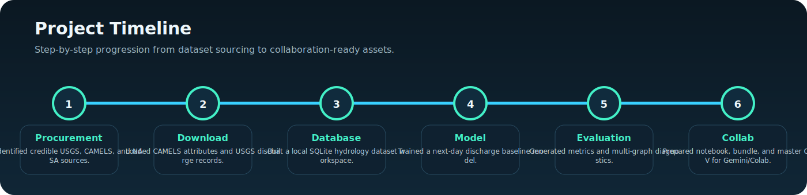

## Main Graphs and Visual Review

### Static output already saved

Prediction plot:

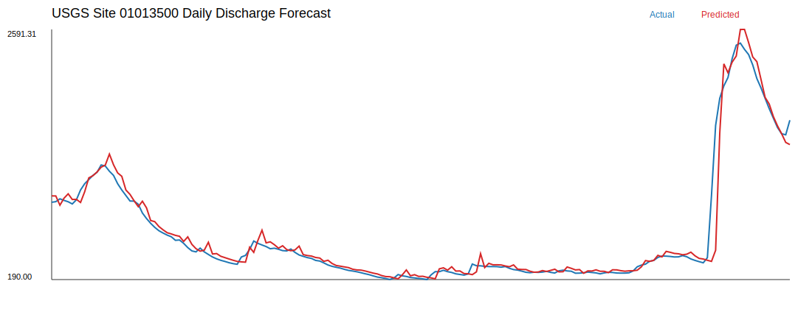

### Visualizations available in the dashboard and notebook

The project includes these evaluation views:

1. Actual vs predicted discharge over time
2. Residuals over time
3. Trend sparkline
4. Actual vs predicted scatter plot
5. Error distribution histogram
6. Rolling 14-day MAE
7. Monthly average actual vs predicted
8. Basin attribute summaries
9. Stage vs discharge relationship
10. Data inventory / feature summaries

Best places to see them:
- [`flood_prediction_modeling/index.html`](./flood_prediction_modeling/index.html)
- [`Flood_Prediction_Collab_Notebook.ipynb`](./Flood_Prediction_Collab_Notebook.ipynb)

## README Visual Summary

These repository-native visuals summarize the master CSV and each major factor family used to support flood prediction analysis.

### General Master CSV visualization

This is the overall merged-table view that shows how all data families fit together in one prediction-ready CSV.

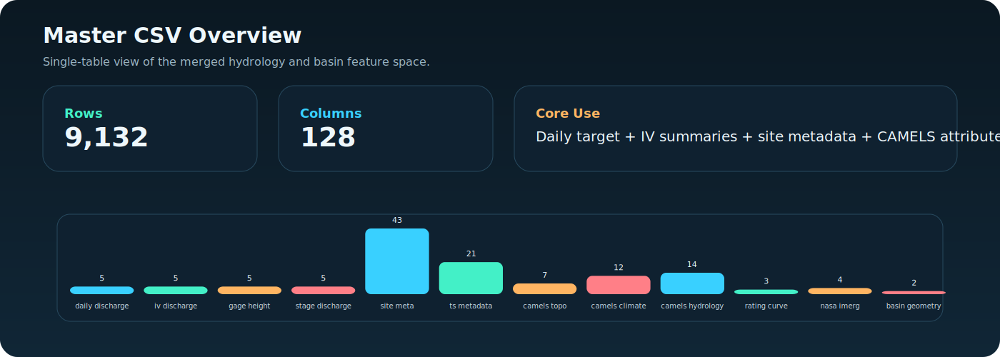

## One Visualization Per Factor Family

### Factor 1. Daily discharge

Long-term discharge behavior and the smoothed monthly trend.

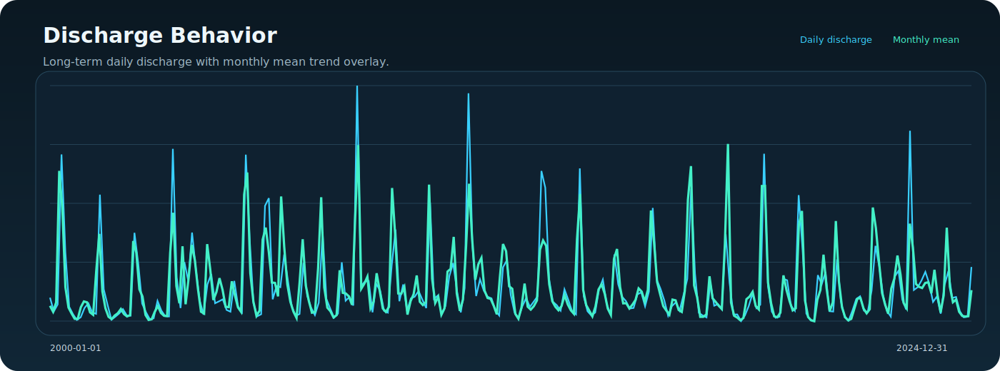

### Factor 2. Instantaneous discharge

Recent mean, minimum, and maximum discharge summaries from the USGS IV feed.

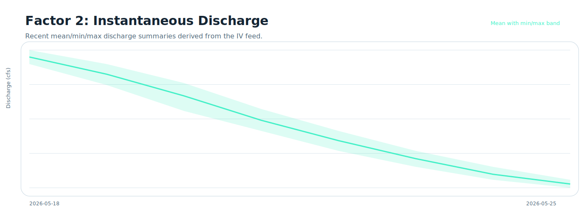

### Factor 3. Gage height / stage

Recent mean, minimum, and maximum stage summaries for the same gauge.

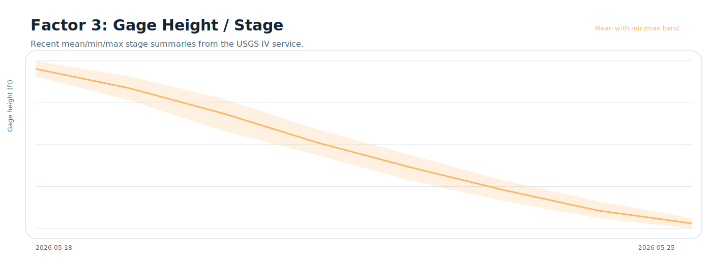

### Factor 4. Stage-discharge relationship

Observed water-level and discharge pairing for the target site.

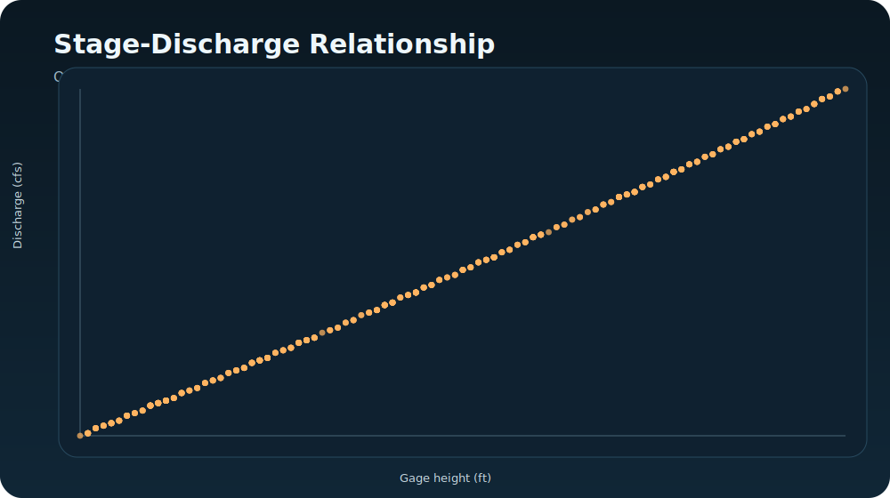

### Factor 5. Site metadata

Key physical and location information for the target USGS gauge.

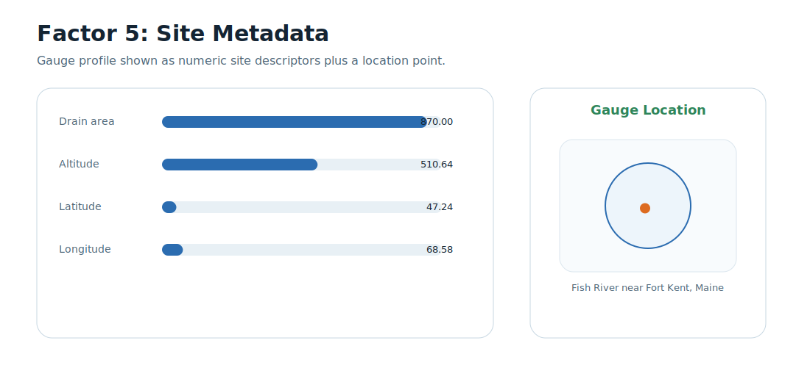

### Factor 6. Time-series metadata

Coverage, units, and computation details for the primary discharge series.

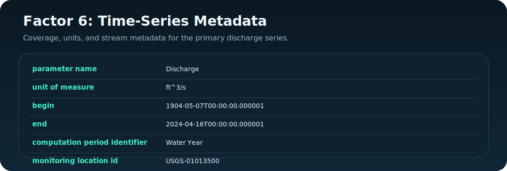

### Factor 7. Topography factors

Static terrain context including slope, elevation, and basin area.

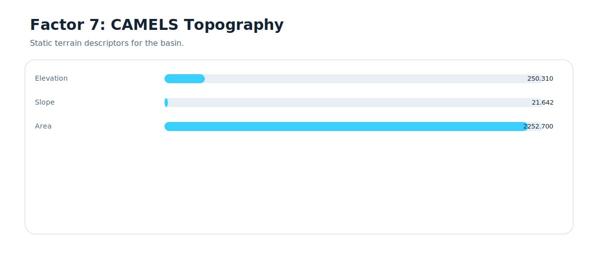

### Factor 8. Climate factors

Static climate descriptors such as precipitation, PET, snow fraction, and aridity.

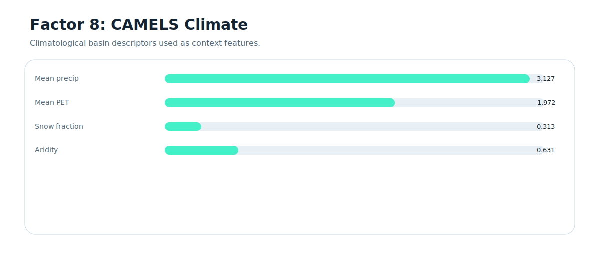

### Factor 9. Hydrology factors

Hydrologic signatures including runoff ratio, baseflow, and flow quantiles.

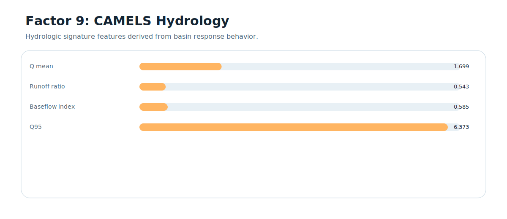

### Factor 10. Rating curve factors

USGS rating-curve file coverage and curve availability for stage/discharge interpretation.

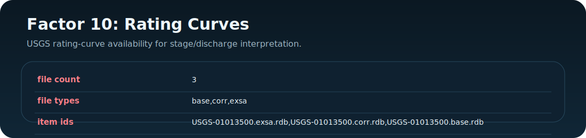

### Factor 11. NASA IMERG metadata factors

Current precipitation metadata path and time coverage for the planned rainfall-driven upgrade.

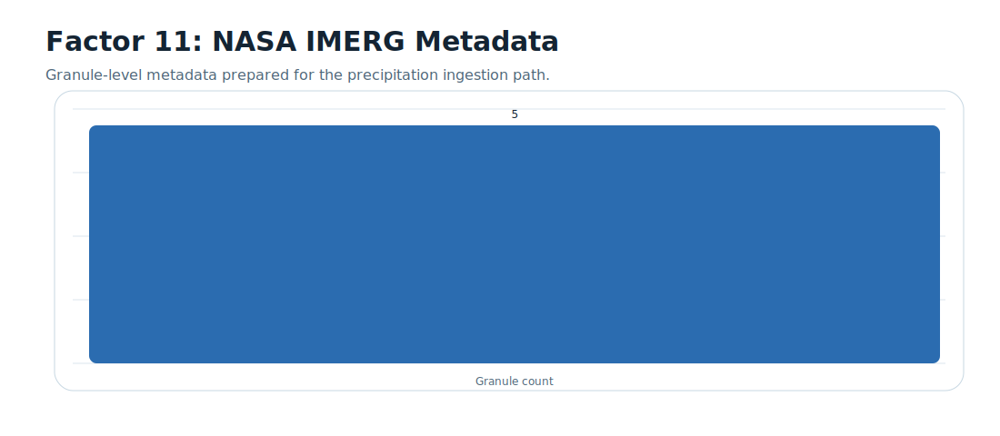

### Factor 12. Basin geometry factors

Upstream basin geometry used to anchor catchment-scale extraction.

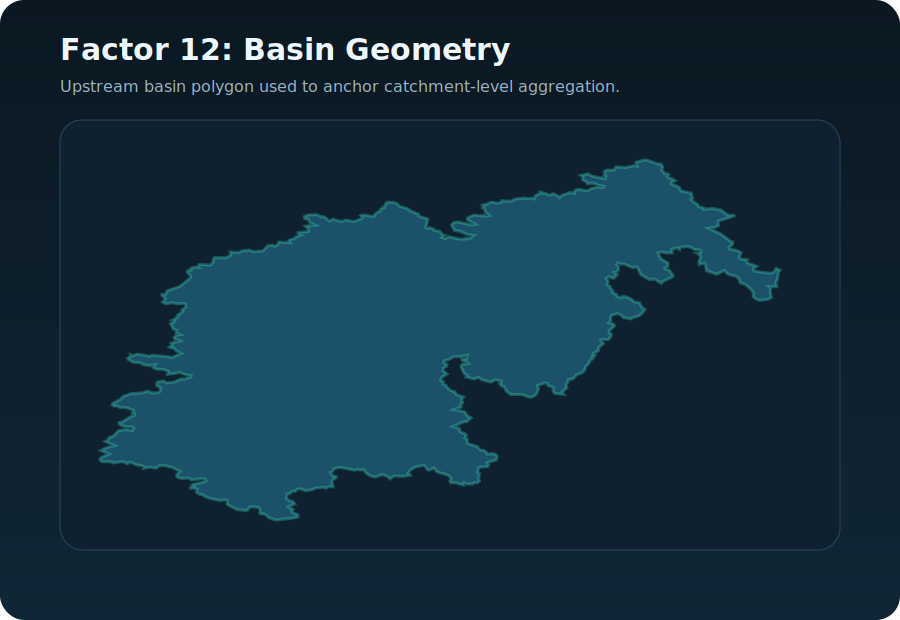

### Combined static-basin board

Topography, climate, and hydrology are also summarized together here for a compact physical-basin view.

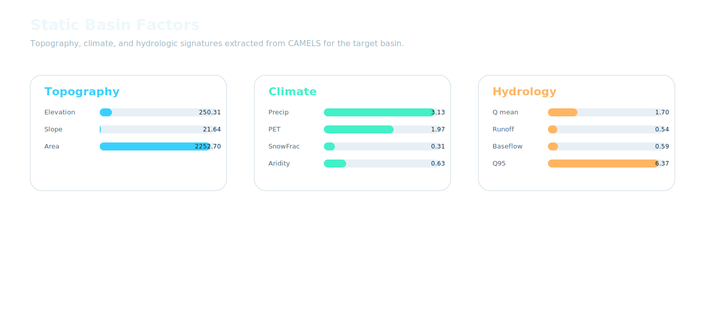

## Combined Flood-Prediction Visualization

This is the combined view showing how all factor families contribute to the final prediction workflow.

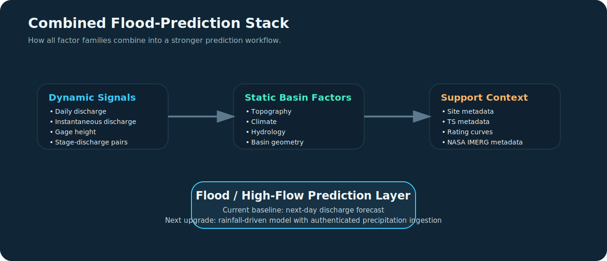

## Step-by-Step Usage

### Option A: Fastest review path

1. Open the dashboard:
   [`flood_prediction_modeling/index.html`](./flood_prediction_modeling/index.html)
2. Read the metrics from:
   [`flood_prediction_modeling/outputs/metrics.json`](./flood_prediction_modeling/outputs/metrics.json)
3. Open the collaboration notebook:
   [`Flood_Prediction_Collab_Notebook.ipynb`](./Flood_Prediction_Collab_Notebook.ipynb)
4. Load the single merged CSV:
   [`master_flood_feature_table.csv`](./flood_prediction_modeling/data/collab_feature_bundle/master_flood_feature_table.csv)

### Option B: Run locally

1. From the repository root, run:

```powershell
.\run_dashboard.ps1
```

2. Open:

```text
http://127.0.0.1:8123/flood_prediction_modeling/index.html
```

### Option C: Re-run the data and model pipeline

1. Move into `flood_prediction_modeling/`
2. Run:

```powershell
& "C:\Users\msrib\.cache\codex-runtimes\codex-primary-runtime\dependencies\python\python.exe" download_data.py
& "C:\Users\msrib\.cache\codex-runtimes\codex-primary-runtime\dependencies\python\python.exe" build_database.py
& "C:\Users\msrib\.cache\codex-runtimes\codex-primary-runtime\dependencies\python\python.exe" train_model.py
& "C:\Users\msrib\.cache\codex-runtimes\codex-primary-runtime\dependencies\python\python.exe" create_collab_feature_bundle.py
& "C:\Users\msrib\.cache\codex-runtimes\codex-primary-runtime\dependencies\python\python.exe" build_master_feature_csv.py
```

## Clean Repository Map

### Top level

- [`README.md`](./README.md): main guide
- [`index.html`](./index.html): landing page / redirect for hosted demo
- [`Flood_Prediction_Collab_Notebook.ipynb`](./Flood_Prediction_Collab_Notebook.ipynb): Colab-ready collaboration notebook
- [`run_dashboard.ps1`](./run_dashboard.ps1): local dashboard launcher

### Modeling workspace

- [`flood_prediction_modeling/README.md`](./flood_prediction_modeling/README.md): technical modeling notes
- [`flood_prediction_modeling/download_data.py`](./flood_prediction_modeling/download_data.py)
- [`flood_prediction_modeling/build_database.py`](./flood_prediction_modeling/build_database.py)
- [`flood_prediction_modeling/train_model.py`](./flood_prediction_modeling/train_model.py)
- [`flood_prediction_modeling/create_collab_feature_bundle.py`](./flood_prediction_modeling/create_collab_feature_bundle.py)
- [`flood_prediction_modeling/build_master_feature_csv.py`](./flood_prediction_modeling/build_master_feature_csv.py)

### Clean data bundle

Folder:
- [`flood_prediction_modeling/data/collab_feature_bundle/`](./flood_prediction_modeling/data/collab_feature_bundle/)

Important files:
- [`00_feature_bundle_manifest.csv`](./flood_prediction_modeling/data/collab_feature_bundle/00_feature_bundle_manifest.csv)
- [`master_flood_feature_table.csv`](./flood_prediction_modeling/data/collab_feature_bundle/master_flood_feature_table.csv)
- [`README.md`](./flood_prediction_modeling/data/collab_feature_bundle/README.md)

### Procurement and schema notes

- [`flood_prediction_procurement/README.md`](./flood_prediction_procurement/README.md)
- [`flood_prediction_procurement/schema.sql`](./flood_prediction_procurement/schema.sql)
- [`flood_prediction_procurement/erd.mmd`](./flood_prediction_procurement/erd.mmd)

## Single CSV for Gemini / Colab

For the cleanest workflow, use this single file:

- [`master_flood_feature_table.csv`](./flood_prediction_modeling/data/collab_feature_bundle/master_flood_feature_table.csv)

It contains:
- `9132` rows
- `128` columns
- daily discharge
- instantaneous discharge summaries
- gage height summaries
- stage-discharge paired summaries
- station metadata
- basin attributes
- rating curve metadata
- NASA IMERG metadata summary
- basin geometry reference

This table is also the source behind the repository-level visual summaries shown above.

## Dataset Status

### Fully integrated

- CAMELS-US attributes
- USGS Water Data API daily discharge
- USGS instantaneous discharge
- USGS gage height
- USGS rating curve metadata and files
- USGS upstream basin geometry

### Partially integrated

- NASA GPM IMERG Early V07

The project includes real IMERG granule metadata, but not authenticated precipitation raster ingestion. Direct binary file download from GES DISC still requires Earthdata authentication.

## Best Next Upgrade

The most important next step is to add authenticated precipitation ingestion and align rainfall to basin-local time so the model can evolve from a discharge-memory baseline into a stronger rainfall-driven flood prediction workflow.
